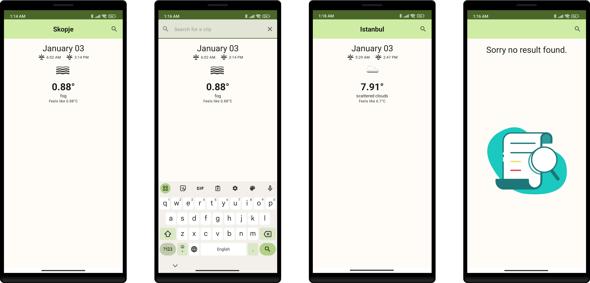

# Weather app

## App features:
Introducing a weather forecast application.

Upon launching the application, users are greeted with a search bar. Simultaneously, the app harnesses the power of GPS technology to effortlessly detect the user's current location. The search bar is intelligently populated with the current location, offering users instant access to the local weather forecast.

Underneath the search bar, users can quickly view the up-to-the-minute weather forecast for their current location.

The app empowers users to explore weather updates for other cities. By simply entering the desired city name into the search bar, users can easily retrieve detailed weather forecasts.

- Use of https://openweathermap.org/api.

## Screenshots

## Architecture
- Written in Kotlin.
- Built with [Jetpack Compose](https://developer.android.com/jetpack/compose).
- Clean architecture, MVVM

# Library references
- Kotlin
- Coroutines - A coroutine is a concurrency design pattern that you can use on Android to simplify code that executes asynchronously
- Flow - Flow is used to pass (send) a stream of data that can be computed asynchronously
- Dagger-Hilt - for dependency injection.
- ViewModel - Stores UI-related data that isn't destroyed on UI changes.
- Room - Used to create room db and store the data.
- Retrofit - Used for REST api communication.
- Coil - Used for displaying and downloading images
- Lottie - Used for displaying custom animations
- Mockk - Used for Test Implementation